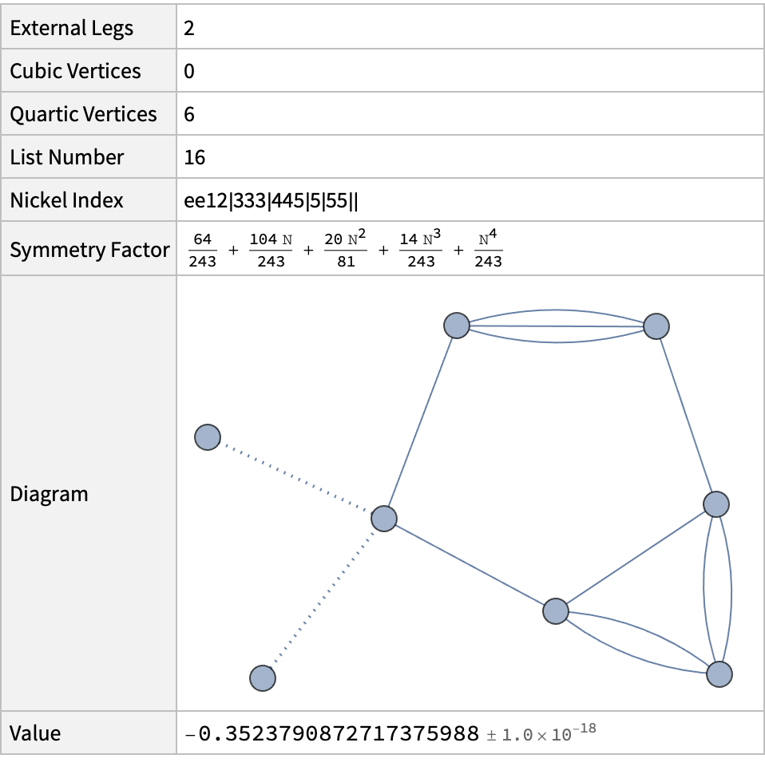

[](https://zenodo.org/doi/10.5281/zenodo.10021884)

# # Phi4tools Wolfram Language Paclet

Development files for the Phi4tools paclet.

<details>
  <summary>Table of Contents</summary>
  <ol>
    <li><a href="#about">About</a></li>
    <li><a href="#installation">Installation</a></li>
    <li><a href="#usage">Usage</a></li>
    <li><a href="#license">License</a></li>
    <li><a href="#contact">Contributors</a></li>
  </ol>
</details>

## About

Phi4tools is an intuitive interface for visualizing, simplifying, and calculating Feynman diagrams in scalar field theories. In more detail, it is possible, using various commands, to display Nickel labels, symmetry factors, integrands, and numerical results associated with diagrams of scalar theories with quartic and cubic interactions.

<div align="center">
  
</div>

## 

<!-- INSTALLATION -->

## Installation

The easiest way to install it is through the [Wolfram Language Paclet Repository][repository-url], evaluating the following code in your Wolfram Language environment:

```mathematica
PacletInstall["GSberveglieri/Phi4tools"]
```

Alternatively, it is possible to get the compiled paclet from the directory `paclet/build` and install it with

```mathematica
PacletInstall["path/to/GSberveglieri__Phi4tools-x.y.z.paclet"]
```

with `path/to/GSberveglieri__Phi4tools-x.y.z.paclet` pointing to the downloaded resource.

<!-- USAGE -->

## Usage

After installation, you can load the code in your Mathematica kernel evaluating this code:

```mathematica
Needs["GSberveglieri`Phi4tools`"]
```

The paclet main guide page can be accessed through the Documentation Center at `GSberveglieri/Phi4tools/guide/Phi4tools`. It is also available online at the [Wolfram Language Paclet Repository][repository-url].

Useful usage examples are provided in the `Tech Notes`.

<!-- LICENSE -->

## License

Distributed under the [MIT License](LICENSE).

<!-- CONTRIBUTORS -->

## Contributors

_Giacomo Sberveglieri, Gabriele Spada_

<!-- MARKDOWN LINKS & IMAGES -->

<!-- https://www.markdownguide.org/basic-syntax/#reference-style-links -->

[hero-image]: images/hero-image.png
[repository-url]: https://resources.wolframcloud.com/PacletRepository/resources/GSberveglieri/Phi4tools/
